# 🎓 Student Performance Analysis Dashboard & Report

📊 **An interactive and analytical student performance project** built with **Python**, **Plotly Dash**, and **Matplotlib**.  
This project visualizes academic data, identifies top performers, tracks attendance impact, and provides real-time insights into overall student outcomes.

---

## 📚 Table of Contents

| Section | Description |
|----------|-------------|
| [🚀 Quick Access / Direct Links](#-quick-access--direct-links) | Open all project files directly |
| [🧠 Project Overview](#-project-overview) | Learn what this project does |
| [✨ Features](#-features) | Key highlights and insights |
| [🛠️ Tools & Technologies Used](#️-tools--technologies-used) | Stack used to build the project |
| [📁 Project Structure](#-project-structure) | Understand folder and file layout |
| [📊 Dashboard & Report Previews](#-dashboard--report-previews) | See screenshots of the interface |
| [⚙️ Setup Instructions](#️-setup-instructions) | Run this project on your machine |
| [📬 Author & Contact](#-author--contact) | Connect or collaborate |

---

## 🚀 Quick Access / Direct Links

| 🔗 Feature | 📁 Direct Link |
|-------------|----------------|
| 🖥️ Interactive Dashboard Code | [Open dashboard_app.py](./dashboard_app.py) |
| 📈 Static Report Version | [Open student_report.py](./student_report.py) |
| 📊 Dataset (50 Students) | [View students.csv](./students.csv) |
| ⚙️ Dataset Generator | [Open data_generator.py](./data_generator.py) |
| 📦 Required Libraries | [View requirements.txt](./requirements.txt) |
| 🌐 GitHub Repository | [Student Performance Analysis Repository](https://github.com/ujjwxll/Student_Performance_Analysis) |
| 💼 Connect on LinkedIn | [linkedin.com/in/ujjwxl-kant](https://www.linkedin.com/in/ujjwxl-kant/) |

---

## 🧠 Project Overview

This project provides a **complete academic analytics system** — featuring both an **interactive dashboard** and a **static report** version.

You can analyze student scores, compare gender-wise performance, track attendance correlation, and highlight top/bottom performers — all within an attractive, responsive dashboard UI.

---

## ✨ Features

✅ Dynamic Dashboard with Filters  
✅ Top 5 Students Leaderboard  
✅ Subject-wise Average Performance  
✅ Gender-Based Analysis  
✅ Grade Distribution Pie Chart  
✅ Attendance vs Average Marks Scatter Plot  
✅ Interactive Data Table with Filters & Search  
✅ Modern Light Theme UI  
✅ Downloadable CSV Data  
✅ Matplotlib + Plotly Integration  
✅ Realistic Dataset with Pass/Fail Records  

---

## 🛠️ Tools & Technologies Used

| Category | Tools |
|-----------|--------|
| **Language** | Python 3.x |
| **Dashboard Framework** | Plotly Dash |
| **Data Manipulation** | Pandas, NumPy |
| **Visualization** | Plotly, Matplotlib, Seaborn |
| **UI Design** | Dash Bootstrap Components |
| **Data Source** | Custom CSV (generated with data_generator.py) |

---

## 📁 Project Structure

📦 Student_Performance_Analysis  
├── dashboard_app.py          # Interactive dashboard with filters and charts  
├── student_report.py         # Static Matplotlib-based analysis report  
├── data_generator.py         # Generates synthetic dataset for 50 students  
├── students.csv              # Main dataset used in the project  
├── requirements.txt          # List of required dependencies  
├── README.md                 # Project documentation (this file)  
├── .gitignore                # Files to ignore during Git upload  
└── screenshots/              # Folder containing preview images  
&emsp;├── dashboard_view.png  
&emsp;├── top_students.png  
&emsp;└── report_view.png  

---

## 📊 Dashboard & Report Previews

Here are some visual insights from the project 👇  

### 🧭 Dashboard Overview

| Dashboard View 1 | Dashboard View 2 | Dashboard View 3 | Dashboard View 4 | Dashboard View 5 |
|------------------|------------------|------------------|------------------|------------------|
| 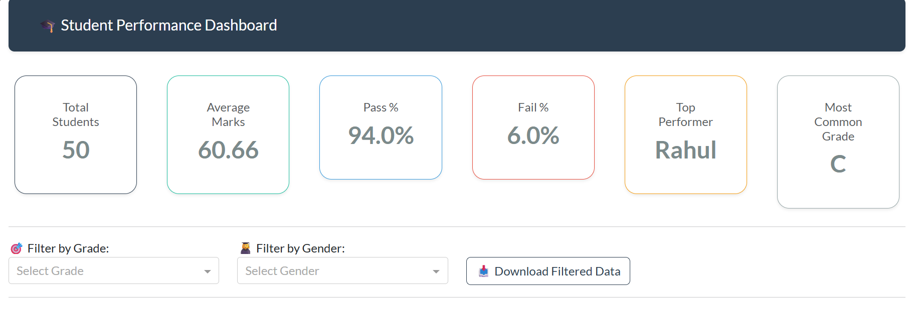 | 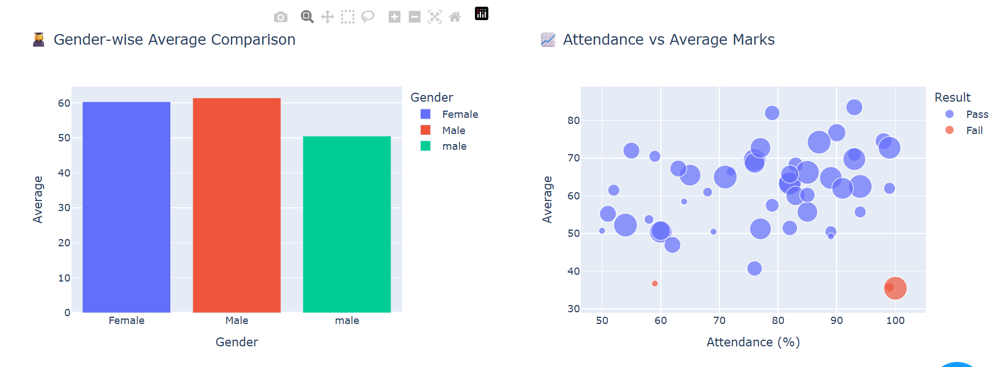 | 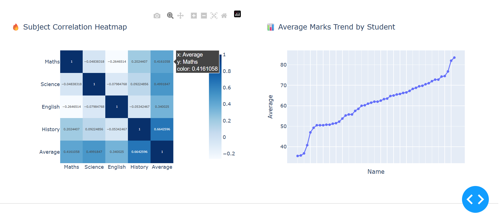 | 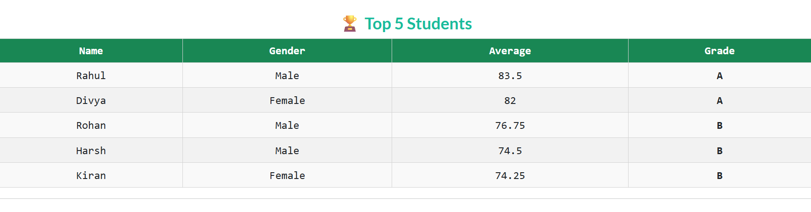 | 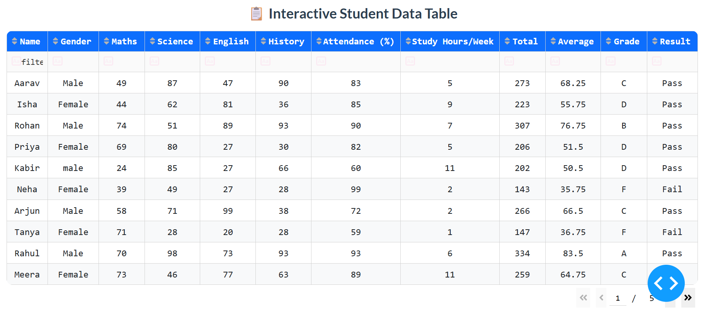 |

---

### 📑 Report Version (Matplotlib + Seaborn)

| Report 1 | Report 2 | Report 3 | Report 4 | Report 5 | 
|-----------|-----------|-----------|-----------|-----------|
|  | 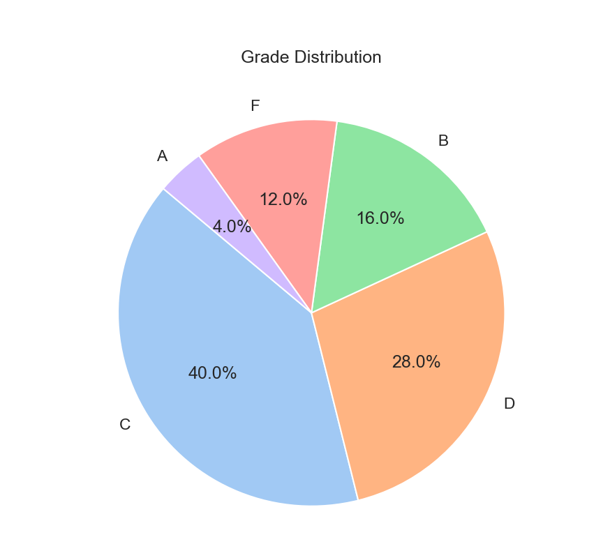 | 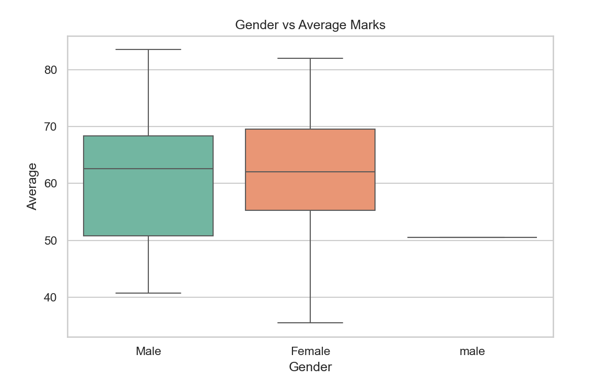 | 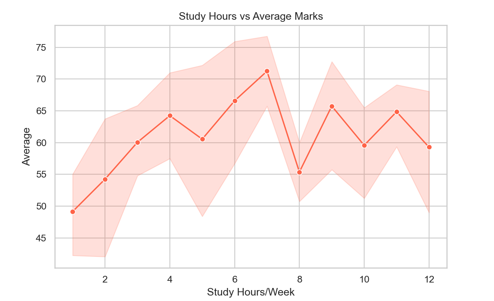 | 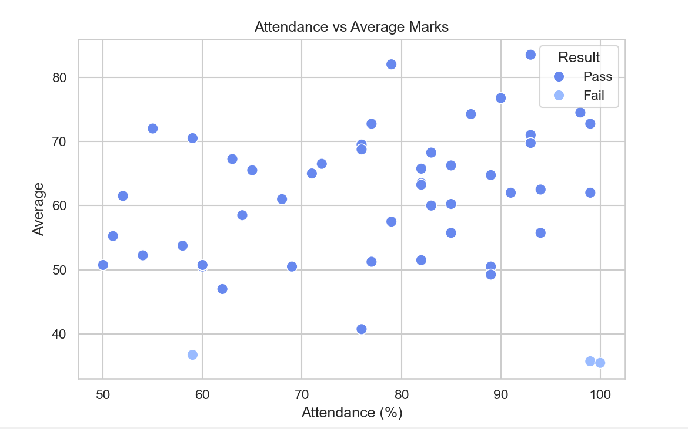 |

---

### 📈 Plotly Reports

| Report View 1 | Report View 2 | Report View 3 | Report View 4 | Report View 5 |
|----------------|----------------|----------------|----------------|----------------|
| 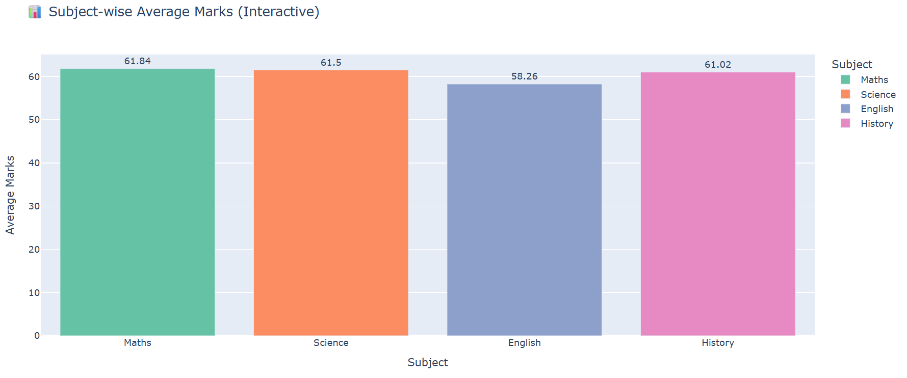 |  | 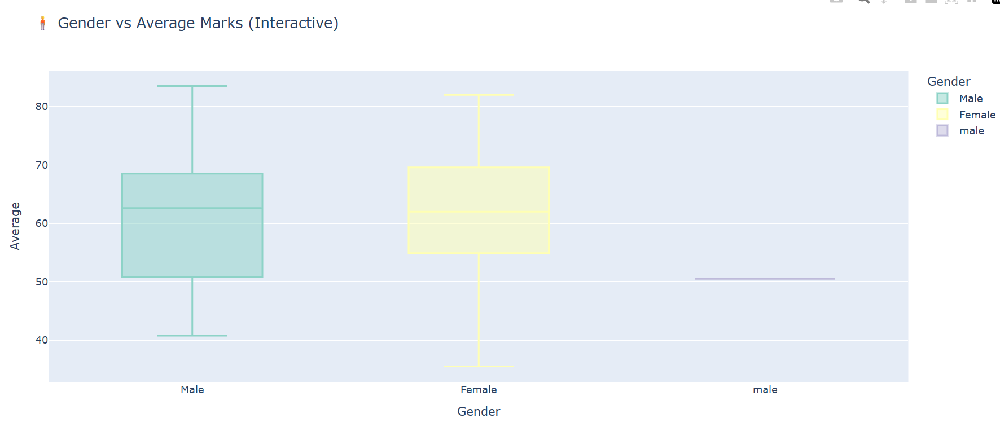 | 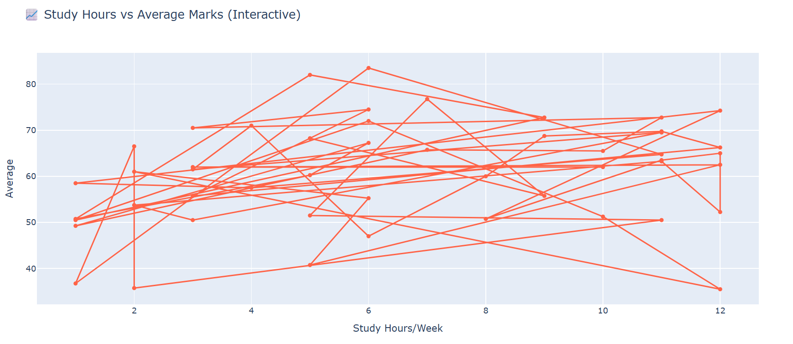 | 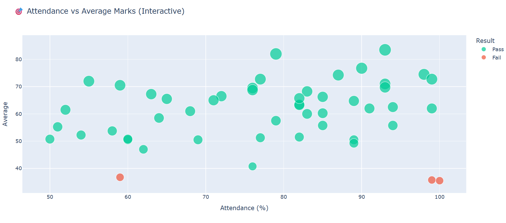 |

---

📬 Author & Contact

👨‍💻 Developed By: [ujjwal_kant]
📧 Email: ujjwalkantujk@gmail.com

💼 LinkedIn: https://www.linkedin.com/in/ujjwxl-kant/

🌐 GitHub: https://github.com/ujjwxll
    